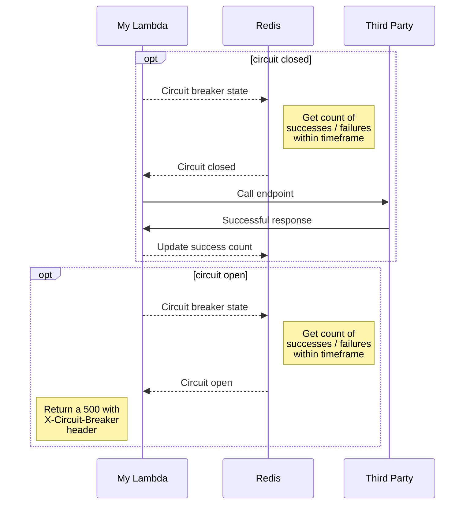

Running python lambdas using distributed circuit breakers.

```mermaid
sequenceDiagram
    participant My Lambda
    participant Redis
    participant Third Party
    opt circuit closed
        My Lambda-->>Redis: Circuit breaker state
        Note right of Redis: Get count of <br/>successes / failures <br/>within timeframe
        Redis-->>My Lambda: Circuit closed
        My Lambda->>Third Party: Call endpoint
        Third Party->>My Lambda: Successful response
        My Lambda-->>Redis: Update success count
    end
    opt circuit open
        My Lambda-->>Redis: Circuit breaker state
        Note right of Redis: Get count of <br/>successes / failures <br/>within timeframe
        Redis-->>My Lambda: Circuit open
        Note left of My Lambda: Return a 500 with<br/>X-Circuit-Breaker<br/>header
    end
```
