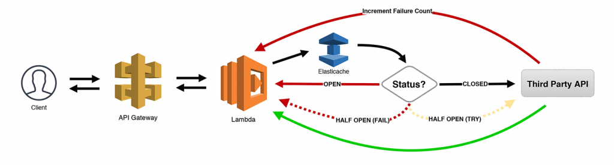

Taken from the article https://www.jeremydaly.com/serverless-microservice-patterns-for-aws/#circuitbreaker 
The Circuit Breaker pattern keeps track of the number of failed (or slow) API calls made using some sort of a state 
machine. For our purposes, we’re using an Elasticache cluster to persist the information (but DynamoDB could also 
be used if you wanted to avoid VPCs).

## Integrating with third party APIs

When calling REST apis, being able to capture the request and response of failing calls, or being able to capture
slow response times is key to being able to identify the underlying cause. With microservices architecture or 
serverless architecture, it can be hard to identify the root cause, especially when you are not responsible
for some of the services. By having the circuit breaker actually wrap the transport to those downstream systems
you are able to get as close to the cause as possible, capturing the failed request/response payloads and headers.

### Monitoring / Alerting

There are a number of approaches you can take to monitoring and alerting. There is one implementation (in progress), 
which pushes the failed requests to DynamoDB. When a circuit trips a message is sent on an SNS topic and a HTTP 
endpoint enables you to see a dashboard of circuit breakers and their history. 